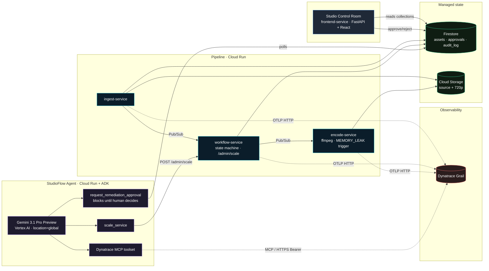

# StudioFlow Agent

> A Gemini 3.1 Pro agent that diagnoses real incidents in a simulated Apple-style media production pipeline, using the Dynatrace MCP server as its primary tool. Every write action is gated behind explicit human approval.

**Hackathon entry**: [Google Cloud Rapid Agent Hackathon — Dynatrace track](https://rapid-agent.devpost.com/). Submission target: **June 11, 2026**.

---

## What it is

StudioFlow is two systems stacked:

1. **The pipeline.** Five event-driven Cloud Run services (ingest → workflow → encode → enrichment → publish) that move a media asset stage to stage, fully instrumented with OpenTelemetry, exporting traces to Dynatrace.
2. **The agent.** A Gemini 3.1 Pro agent built with [Google ADK](https://adk.dev) that uses the [Dynatrace remote MCP server](https://docs.dynatrace.com/) to autonomously detect, diagnose, and propose remediation for incidents in that pipeline — under a `HumanApprovalGate` that blocks every write action until an operator clicks Approve.

The pipeline is the substrate; the agent is the product.

## Hosted demo

| Surface | URL |
|---|---|
| **Studio Control Room (UI)** | https://frontend-service-vb6z2eah4a-uc.a.run.app |
| Agent diagnose API | https://agent-service-vb6z2eah4a-uc.a.run.app/diagnose |
| Ingest, workflow, encode | `*-service-vb6z2eah4a-uc.a.run.app` |

The Control Room shows live pipeline state from Firestore. The chaos script triggers a deliberate OOM in the encode service; the agent picks it up from Dynatrace, builds an `IncidentResponse`, and submits it to the approval gate. The operator clicks Approve in the UI, the agent unblocks, and the remediation lands in an audit log.

## The 3-minute demo

1. **0:00–0:20** Studio Control Room loads. Live pipeline state. Services healthy.
2. **0:20–0:40** Trigger chaos. `scripts/chaos.sh` or a direct POST burst pushes 7 concurrent encoding requests for a 505 MB asset to encode-service. The deliberately-fragile MEMORY_LEAK path fires, encode 500s with `boom.oom_killed=true` spans landing in Dynatrace.
3. **0:40–2:00** Agent diagnoses. Pro 3.1 fires multiple DQL queries through the Dynatrace MCP, finds the OOM traces, cites them by trace ID, builds a structured `RemediationPlan`.
4. **2:00–2:20** Approval gate. Plan appears in the UI as a pending card. Operator clicks Approve.
5. **2:20–2:50** Remediation. Agent calls `scale_service(studioflow-encode, 2048, approval_id)` against workflow-service's `/admin/scale`. Audit log entry is written. UI shows it as a toast.
6. **2:50–3:00** Wrap. The agent posts its post-incident summary referencing every trace and the audit ID.

Full shot list in [docs/demo-script.md](./docs/demo-script.md).

## Architecture



Details: [docs/architecture.md](./docs/architecture.md), [CLAUDE.md](./CLAUDE.md) §4.

## Stack

- **Brain**: Gemini 3.1 Pro Preview (`gemini-3.1-pro-preview` via Vertex AI `locations/global`)
- **Framework**: Google ADK (`google-adk>=1.10`) — `LlmAgent` + `McpToolset` + `FunctionTool`
- **Partner MCP**: Dynatrace remote MCP gateway, Platform Token bearer auth, 10-tool allowlist
- **Pipeline runtime**: Python 3.12 FastAPI services on Cloud Run, ffmpeg in the encode image
- **State**: Firestore (`assets/`, `approvals/`, `audit_log/`)
- **Events**: Pub/Sub topic `studioflow-events`, push subscriptions per service
- **Observability**: OpenTelemetry SDK with OTLP HTTP export to Dynatrace `.live.` ingest
- **Build / deploy**: Cloud Build per-service, Artifact Registry, single-command `scripts/deploy.sh`
- **Frontend**: HTML/JSX prototype loaded via CDN React, served by a FastAPI shim that proxies live Firestore reads/writes

## What's worth a closer look

- **`services/agent/approval_gate.py`** — the `request_remediation_approval` tool. The agent submits a structured plan to Firestore `approvals/{id}` and the function polls until status flips to `approved`/`rejected`/`timeout`. This blocks the entire agent loop and is exactly what makes the demo's "while keeping you in control" promise real.
- **`services/workflow/main.py`** `/admin/scale` — the Pipeline API surface. Verifies the approval doc, writes an audit entry, returns the audit ID. Agent never holds Cloud Run admin credentials.
- **`services/observability/tracer.py`** — non-trivial: Dynatrace OTLP ingest needs a classic API token (`dt0c01.*`) on `.live.dynatrace.com`, while MCP needs a Platform Token (`dt0s.*`) on `.apps.dynatrace.com`. The tracer refuses to configure if it sees a Platform Token under `DYNATRACE_API_TOKEN` and fails loud.
- **`services/encode/main.py`** — the deliberately fragile service. Sync `def` handler so multiple threads can actually share state, force-flushes the OOM-breadcrumb span before raising a clean 500 (so the agent has evidence even when the container is under pressure).
- **[`docs/build-plan.md`](./docs/build-plan.md)** — the schedule we actually built against, day by day.

## Reproduce locally

Prereqs: a GCP project with billing, Vertex AI enabled with Gemini 3.x access on `global`, a Dynatrace tenant on `.apps.dynatrace.com` (Grail / Platform), `gcloud`, `uv`, `gh`.

```bash
# 1. Clone + cd
git clone https://github.com/alanmaizon/studioflow
cd studioflow

# 2. Fill in .env (template in .env.example)
cp .env.example .env
$EDITOR .env                                 # PROJECT_ID, DT_TENANT, etc.

# 3. Seed secrets in Secret Manager
echo -n "$DT_TOKEN" | gcloud secrets create dynatrace-token --data-file=-
echo -n "$DYNATRACE_API_TOKEN" | gcloud secrets create dynatrace-otlp-token --data-file=-
echo -n "$DT_TENANT" | gcloud secrets create dynatrace-tenant --data-file=-

# 4. Verify OTLP path with a synthetic span
uv run scripts/verify-trace.py                # expect: ✅ Trace exported.

# 5. Deploy everything
scripts/deploy.sh all                         # ~12 minutes for cold builds

# 6. Drive the demo
scripts/chaos.sh                              # triggers MEMORY_LEAK on encode
curl -X POST $(gcloud run services describe agent-service \
  --format='value(status.url)')/diagnose \
  -H "Content-Type: application/json" -d '{}'
# open the frontend URL, click Approve when the gate card appears
```

## Repo layout

```
studioflow/
├── CLAUDE.md                    ← design contract; read first
├── README.md                    ← this file
├── docs/
│   ├── architecture.md          ← rationale + service contracts
│   ├── build-plan.md            ← what we built when
│   ├── day-1-checklist.md       ← bootstrapping
│   ├── demo-script.md           ← the 3-min video shot list
│   └── apple-narrative.md       ← interview talking points
├── services/
│   ├── ingest/                  ← FastAPI multipart → GCS + Firestore
│   ├── workflow/                ← state machine + /admin/* (Pipeline API)
│   ├── encode/                  ← ffmpeg + scripted MEMORY_LEAK
│   ├── observability/           ← shared OTel tracer module
│   ├── agent/                   ← ADK agent + FastAPI shim + tools
│   └── frontend/                ← static prototype + live Firestore API
├── frontend/                    ← design system + Studio Control Room UI kit
├── infra/                       ← (reserved for Terraform)
└── scripts/
    ├── deploy.sh                ← per-service Cloud Build deploy
    ├── chaos.sh                 ← the demo's failure trigger
    └── verify-trace.py          ← OTLP smoke test
```

## License

Apache 2.0 — see [LICENSE](./LICENSE).
